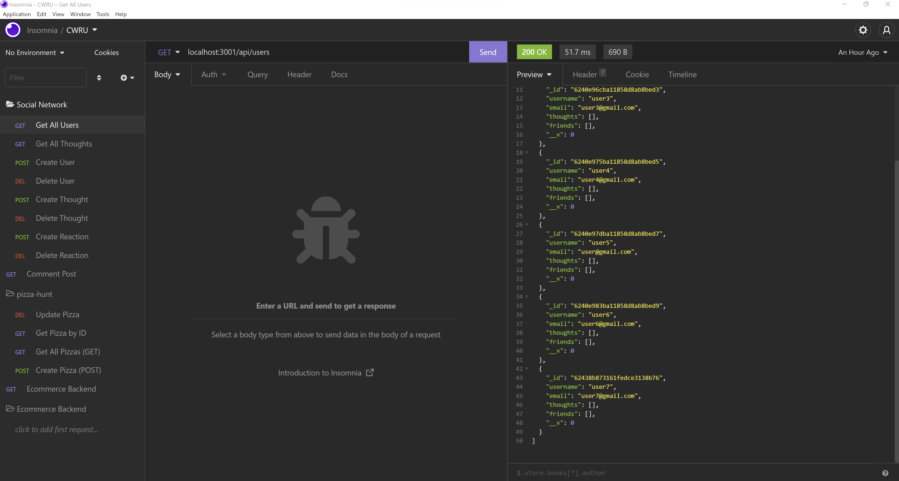
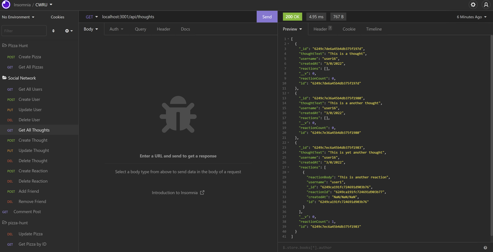

# Social Network

## Table of Contents

[Description](#description)  
[Installation](#installation)  
[How it works](#how-it-works)  
[Usage](#usage)  
[Utilizes](#utilizes)  
[Credits](#credits)  
[Questions](#questions)  
[License](#license)

## Description

Social Network serves as the backend for a fictional social networking website. This was my first project using an ODM database structure (MongoDB), and I used the Mongoose library as the interface between that and the express API. In its current build, the project has the following features:

- Query, create, update and delete users
- Query, create, update and delete thoughts (i.e., user comments)
- Create and delete reactions (i.e, comment replies)
- Add and remove user friends

## Installation

This application requires Node and Express.

## How it works

The application utilizes the Mongoose JavaScript library as an intermediary for the Express.js server and the MongoDB database. You can find more information on Mongoose here:

https://mongoosejs.com/docs/api.html

With that in mind, three models constitute the backbone of the application;

- The User model, which instantiates instances of users in the social network. It is based on a schema with the following fields:

  - username: String type, required; must be unique and under 50 characters in length; trimmed.
  - email: String type, required; must be unique and constitute a valid email address.
  - thoughts: Array of Mongoose Object ID type objects, references the Thought model.
  - friends: Array of Mongoose Object ID type objects, self-reference to User model.
  - friendCount: Virtual property that provdes a count of friends belonging to the user.

- The Thought model, which instantiates instances of thoughts (i.e., user comments) in the application. The model's schema includes the following:

  - thoughtText: String type, required; must be between 1 and 280 characters in length.
  - createdAt: Date type, created automatically. Formatted upon retrieval from database using a getter and custom helper function.
  - username: String Type, references the User model.
  - reactions: Array of ObjectID type objects. References the Reactions model.
  - reactionCount: Virtual property provides a count of reactions belonging to a thought.

- Lastly, the Reaction model, which instantiates comment replies.

  - ReactionId: Mongoose ObjectID type.
  - reactionBody: String type, required, must be no more than 280 characters in length.
  - username: String type, references the User model.
  - createdAt: Date type, formatted upon retrieval using getter that utilizes helper function.

Controller files provide the functionality for the routes. The controllers use Mongoose's native methods to query and modify database documents.

## Usage

The application is currently not integrated with a front end, so functionality must be tested using an API client like Insomnia (used for this demonstration). To illustrate, the following two images display queries to retrieve all users and all thoughts from the database;

Additionally, a demonstration video can be found in the link below:

https://drive.google.com/file/d/1_i5ghvc22cHvSNMPgAjykX__zPVmDHEi/view

## Utilizes

- JavaScript
- Node.js
- Express
- MongoDB
- Mongoose

## Questions

Feel free to shoot me any questions at the email below:

rrich.kray.93@gmail.com

find my GitHub profile by following the link below:

https://github.com/rrich-kray/

## License

Copyright (c) 2022, Ryan Kray
All rights reserved.

This source code is licensed under the BSD-style license found in the LICENSE file in the root directory of this source tree and reproduced below.

Redistribution and use in source and binary forms, with or without modification, are permitted provided that the following conditions are met:

1. Redistributions of source code must retain the above copyright notice, this list of conditions and the following disclaimer.
2. Redistributions in binary form must reproduce the above copyright notice, this list of conditions and the following disclaimer in the documentation and/or other materials provided with the distribution.
3. All advertising materials mentioning features or use of this software must display the following acknowledgement: This product includes software developed by Ryan Kray.
4. Neither the name of this application's developer nor the names of its contributors may be used to endorse or promote products derived from this software without specific prior written permission.

THIS SOFTWARE IS PROVIDED BY THE COPYRIGHT HOLDER ''AS IS'' AND ANY EXPRESS OR IMPLIED WARRANTIES, INCLUDING, BUT NOT LIMITED TO, THE IMPLIED WARRANTIES OF MERCHANTABILITY AND FITNESS FOR A PARTICULAR PURPOSE ARE DISCLAIMED. IN NO EVENT SHALL THE COPYRIGHT HOLDER OR CONTRIBUTORS BE LIABLE FOR ANY DIRECT, INDIRECT, INCIDENTAL, SPECIAL, EXEMPLARY, OR CONSEQUENTIAL DAMAGES (INCLUDING, BUT NOT LIMITED TO, PROCUREMENT OF SUBSTITUTE GOODS OR SERVICES; LOSS OF USE, DATA, OR PROFITS; OR BUSINESS INTERRUPTION) HOWEVER CAUSED AND ON ANY THEORY OF LIABILITY, WHETHER IN CONTRACT, STRICT LIABILITY, OR TORT (INCLUDING NEGLIGENCE OR OTHERWISE) ARISING IN ANY WAY OUT OF THE USE OF THIS SOFTWARE, EVEN IF ADVISED OF THE POSSIBILITY OF SUCH DAMAGE.
